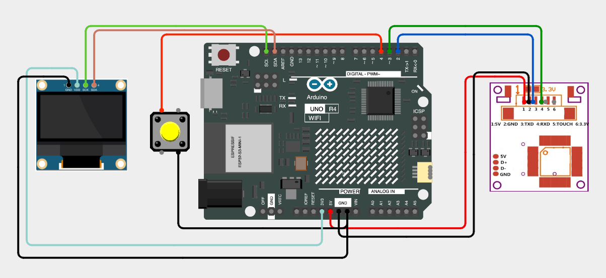

# ARD-010-Biometric-Voting-Machine-with-Arduino-UNO-Ek-R4-WiFi🗳️
Secure the voting process with this Biometric Voting Machine project powered by the Arduino UNO R4 WiFi and R307 fingerprint sensor. This project ensures only registered users can vote once, displaying results on an OLED screen for a real-world smart voting experience.

---

## 🛠 Components Required

1. [Arduino UNO R4 WiFi](https://robocraze.com/products/original-arduino-uno-ek-r4-wifi-made-in-india?_pos=2&_psq=Arduino+uno+ek&_ss=e&_v=1.0)
2. [Type-C USB Cable (1m)](https://robocraze.com/products/type-c-usb-cable-1-metre?_pos=2&_psq=C+TYPE&_ss=e&_v=1.0)
3. [R307 Optical Fingerprint Sensor Module](https://robocraze.com/products/r307-optical-fingerprint-sensor-module?_pos=3&_psq=FINGER&_ss=e&_v=1.0)
4. [1.3 inch OLED Display](https://robocraze.com/products/1-3in-oled-display?_pos=6&_psq=oled&_ss=e&_v=1.0)
5. [Push Button Switch (6x6x5mm)](https://robocraze.com/products/4-pins-dip-momentary-square-tactile-push-button-switch-10-pieces-6x6x5mm?_pos=1&_sid=7a5518733&_ss=r)
6. [Breadboard](https://robocraze.com/products/breadboard?_pos=3&_psq=BREADBOARD&_ss=e&_v=1.0)
7. [Jumper Wires (Male to Female, 20cm)](https://robocraze.com/products/f2m-jumper-wires-20cm-40pcs?_pos=1&_psq=JUMPER+WIRES&_ss=e&_v=1.0)

---

## 🎥 Project Demo

👉 [Watch on Instagram](https://www.instagram.com/reel/DPd_mztE5DP/?igsh=MWxuZHl4ZTkyd3JpaQ==)

---

## Circuit Diagram

---
